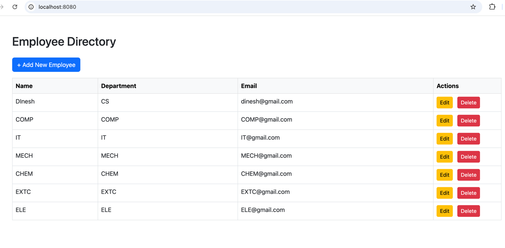
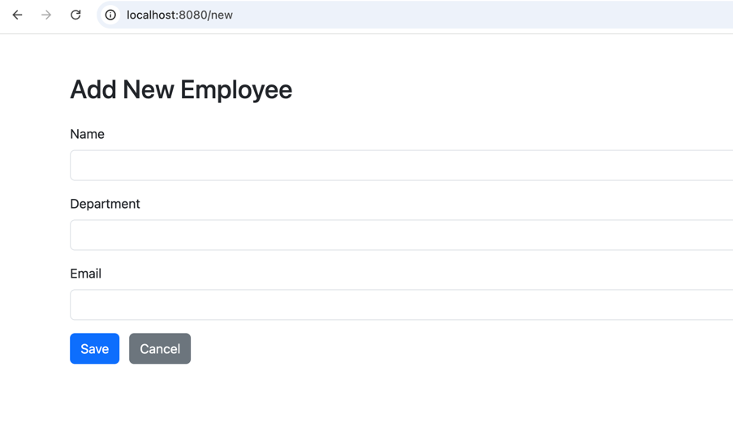
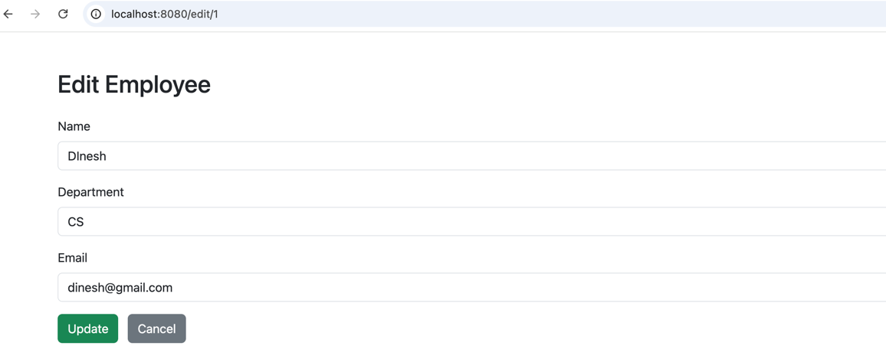
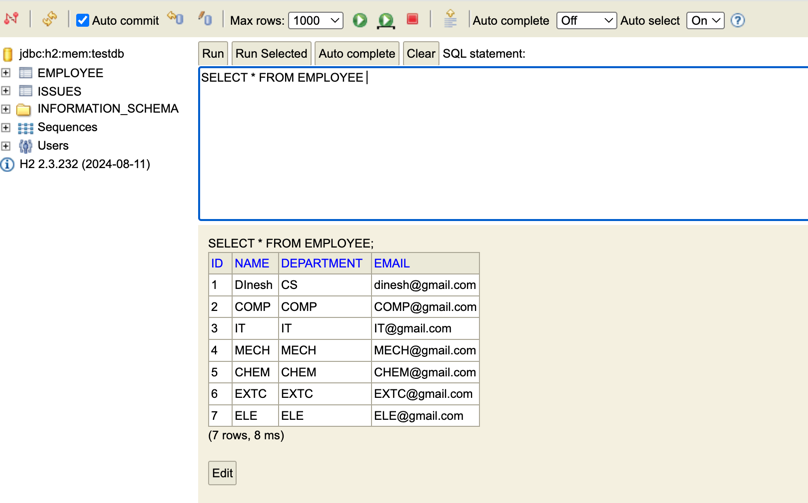

# SpringBootSample – Employee Management Demo

A Spring Boot demo project showcasing simple **Employee** CRUD operations via REST APIs and a Bootstrap-powered web interface using **static and dynamic HTML pages**.

---

## 🧩 Features

- ✅ RESTful API for managing employees
- 🌐 HTML form for employee submission using Thymeleaf
- 🗂 Static landing page (`index.html`)
- 🧠 H2 in-memory database with Spring Data JPA
- 💡 Configuration via `application.properties`

---

## 👥 Employee Entity

```java
public class Employee {
    private Long id;
    private String firstName;
    private String lastName;
    private String email;
}
````

---

## 🌍 Web Pages Overview

| Page               | Path              | Description                     |
| ------------------ | ----------------- | ------------------------------- |
| Static Homepage    | `/index.html`     | Landing page with quick links   |
| Employee Form (UI) | `/employees/form` | Add employee via Thymeleaf form |
| API (JSON List)    | `/employees`      | List of employees (JSON)        |
| H2 Console         | `/h2-console`     | In-browser database viewer      |

---

## 📁 File Structure

```
SpringBootSample/
├── src/
│   ├── main/
│   │   ├── java/com/example/
│   │   │   ├── SpringBootSampleApplication.java
│   │   │   ├── entity/Employee.java
│   │   │   ├── repository/EmployeeRepository.java
│   │   │   ├── service/EmployeeService.java
│   │   │   └── controller/EmployeeController.java
│   │   └── resources/
│   │       ├── application.properties
│   │       ├── static/
│   │       │   └── index.html               # Static landing page
│   │       └── templates/
│   │           └── employee-form.html       # Thymeleaf employee form
└── pom.xml
```

---

## 🚀 How to Run

### 🧰 Prerequisites

* Java 17+
* Maven 3.6+

### ▶️ Launch the Application

```bash
git clone https://github.com/dinesh-veer/some-samples-springboot.git
cd some-samples-springboot/SpringBootSample
mvn spring-boot:run
```

---

## 🌐 Accessing the App

| URL                                    | Description                        |
| -------------------------------------- | ---------------------------------- |
| `http://localhost:8080/index.html`     | Static homepage                    |
| `http://localhost:8080/employees/form` | Thymeleaf employee submission form |
| `http://localhost:8080/employees`      | JSON list of all employees         |
| `http://localhost:8080/h2-console`     | In-memory database viewer          |

> H2 JDBC URL: `jdbc:h2:mem:employeesdb`

---

## ⚙️ Configuration (`application.properties`)

```properties
spring.datasource.url=jdbc:h2:mem:employeesdb
spring.datasource.driverClassName=org.h2.Driver
spring.datasource.username=sa
spring.datasource.password=
spring.jpa.hibernate.ddl-auto=update
spring.thymeleaf.cache=false
```
## 🖼️ Screenshots

### 🔹 Static Homepage



### 🔹 Add Employee Form Edit(Thymeleaf)




### 🔹 Employee Form Edit(Thymeleaf)



### 🔹 H2 Database Console




---

## 🛠 Future Enhancements

* ✅ Add validation (JSR-303)
* 📦 Convert to WAR and deploy on Tomcat
* 🔐 Add Spring Security (login)
* 🧪 Write tests (JUnit, MockMvc)

---

## 📄 License

This project is licensed under the [MIT License](../LICENSE).
© Dinesh Veer
